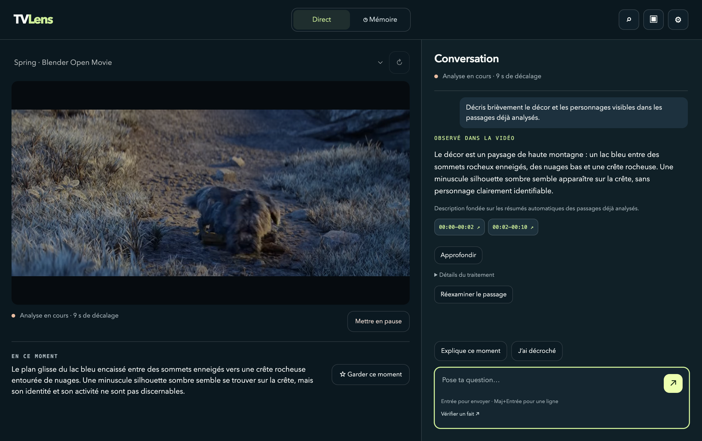
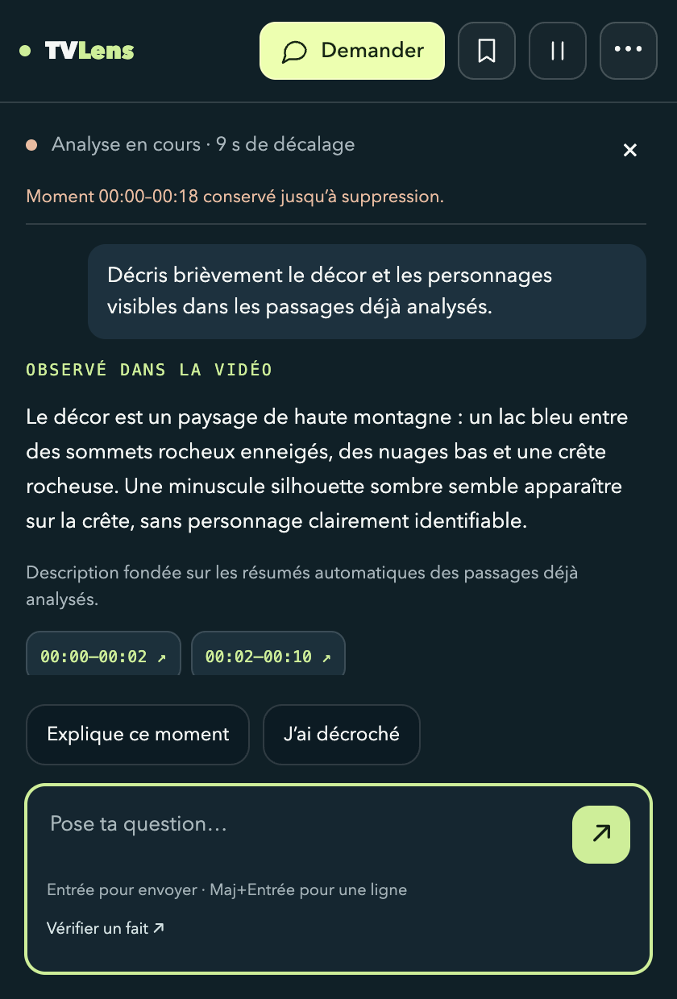
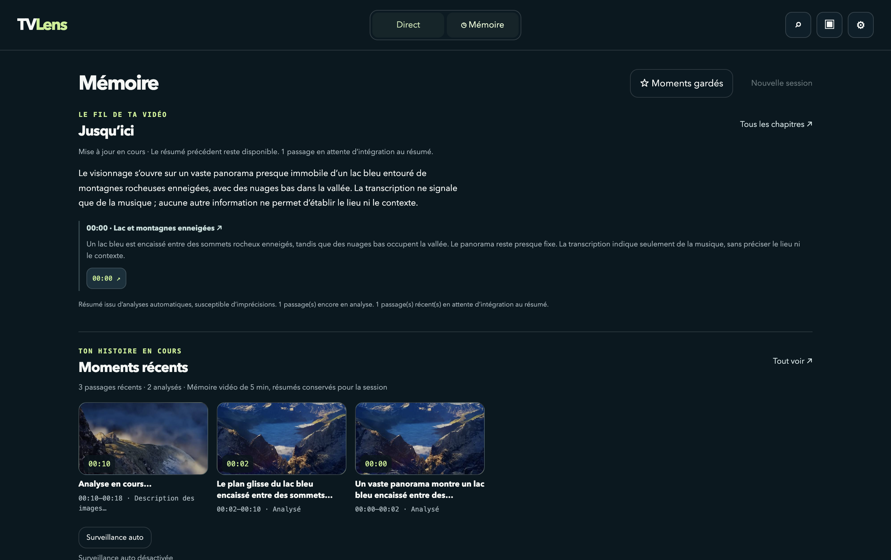

<div align="center">

# TVLens

### La vidéo continue. Le contexte reste.

**Pose une question sur ce que tu regardes. Retrouve le moment. Explore les preuves.**

Un compagnon de visionnage avec une mémoire audiovisuelle — sur Mac, puis directement à côté de YouTube sur une TV LG.

**App macOS · Companion LG · Frise de session · Chat & sources · Serveur privé Tailscale**

[Essayer sur Mac](docs/installation.md) · [Companion TV](docs/lg-timeline.md) · [Déployer le serveur](docs/server-installation.md) · [Architecture](docs/architecture.md) · [Documentation](docs/README.md)

</div>



> **« Ça parle de quoi ? »** · **« Qu’est-ce qu’il disait tout à l’heure ? »** · **« Tu as une source ? »**
>
> Plus besoin de reconstruire tout le contexte dans un chatbot. TVLens observe le contenu, garde une mémoire de la session et rattache ta question au moment où tu la poses.

**POC fonctionnel et testé sur Mac et sur une LG rootée, avec calcul sur Mac ou VPS personnel.** Le chat et la vision utilisent aujourd’hui Codex ; Whisper transcrit l’audio sur l’hôte de calcul. L’inférence entièrement locale sur **ASUS Ascent GX10** est la prochaine hypothèse à valider.

## Une question, son contexte, ses preuves

TVLens ne se limite pas à décrire la dernière image. L’agent peut consulter la transcription, rechercher un moment passé, réexaminer les images disponibles et chercher des sources sur le web. Il réutilise la conversation et les preuves obtenues pour les questions suivantes.

| Tu veux… | TVLens te permet de… |
| --- | --- |
| **Comprendre le présent** | Poser une question sur le contenu récent, avec des références aux passages observés. |
| **Retrouver le passé** | Interroger la mémoire temporelle ; rechercher par texte et, avec OpenRouter, par similarité sémantique. |
| **Examiner un détail** | Réanalyser un intervalle avec des planches d’images numérotées et horodatées. |
| **Vérifier une information** | Consulter des sources externes et distinguer ce qu’affirme la vidéo de ce qu’elles étayent. |
| **Suivre le fil** | Parcourir les sujets et événements de la session, leurs résumés et leurs paroles disponibles. |
| **Poser plusieurs questions** | Utiliser une file visible, avec annulation individuelle et ancrage temporel conservé. |

Les états de capture, d’analyse, d’attente et d’erreur sont distincts. La progression décrit les étapes réellement exécutées, sans exposer de raisonnement interne. Une réponse provisoire n’est pas présentée comme une preuve vérifiée.

## Sur Mac : complet quand tu explores, discret quand tu regardes

**Direct** réunit la vidéo, le contexte et le chat. **Mémoire** rassemble les passages, le résumé progressif, la recherche et les moments gardés. Le **mode flottant** laisse le lecteur au premier plan : une barre compacte, un chat qui se déplie quand tu en as besoin.

<p align="center">
  
  
</p>

Les actions Mac permettent aussi de **garder un moment**, **rattraper ce que tu as manqué**, relire une citation disponible ou activer **Auto** avec une consigne ciblée : « Surveille les chiffres sur l’économie ». Auto commence à son activation ; tes questions restent prioritaires.

<details>
<summary>Voir la mémoire de session sur Mac</summary>



</details>

*Captures de l’app avec un véritable extrait de **Spring**. [Protocole et crédits](screenshots/current/README.md).*

## Sur la TV : le programme reste à l’écran

Sur la **LG 75QNED87T rootée de test**, YouTube continue pendant que TVLens propose deux vues exclusives :

- **Chat à droite** : question dictée via le micro du clavier LG, réponses et références temporelles.
- **Frise en bas** : environ un tiers de l’écran, vidéo entière réduite au-dessus, cartes par sujet ou événement sur toute la session.

Les miniatures apparaissent dès réception ; titres et résumés arrivent avec l’analyse. Tu peux remonter le passé sans perdre ta position, ouvrir le détail, afficher les paroles ou **questionner ce moment** avec son intervalle attaché au chat. Les miniatures restent pendant la session, même après expiration du média détaillé.

Le companion s’ouvre avec **Rakuten** sur la télécommande configurée. La capture démarre manuellement ; **Arrêter / Reprendre** conserve le contexte. Retour ferme le panneau. Le bouton micro physique direct reste une fonction LG : la dictée TVLens passe par le clavier.

→ [Navigation et frise](docs/lg-timeline.md) · [Capture et reprise](docs/lg-capture-control.md)

## Le même cœur, plusieurs lieux de calcul

| Parcours livré | Capture | Calcul et interface |
| --- | --- | --- |
| **Mac autonome** | Fenêtre/écran et son système via Electron | Moteur sur le Mac ; interface complète ou flottante |
| **LG → Mac** | Images et audio de YouTube sur la TV rootée | Moteur sur le Mac ; companion sur la TV |
| **LG → VPS privé** | Même adaptateur TV | Moteur Linux sans Electron ; échanges via Tailscale ; companion sur la TV |

Le serveur VPS écoute uniquement sur son adresse Tailscale, avec authentification par jeton. TVLens et Tailscale sont configurés pour démarrer automatiquement. La coexistence avec le LAN et CyberGhost Japon a été testée ; le VPN Internet reste indépendant du companion.

**Les interfaces n’ont pas encore toutes les mêmes commandes.** Le marque-page durable, l’interface Auto, la recherche dédiée et la relecture sont disponibles sur Mac. La TV dispose du chat et de la frise avec détail/paroles/question contextualisée ; sa frise n’ajoute pas de lecteur vidéo.

→ [Installer sur son serveur Linux](docs/server-installation.md) · [Mesures du VPS et retour au Mac](docs/vps-deployment.md) · [Tailscale sur la LG](docs/lg-tailscale.md)

## Essayer sur Mac

Prérequis : **Mac Apple Silicon, Node.js 24+, Homebrew, Codex CLI connecté** et autorisations macOS pour l’écran et le son système.

```sh
npm ci
brew install ffmpeg
npm run setup:speech
npm run setup:codex
npm start
```

Choisis une fenêtre vidéo, lance l’observation, puis pose une question. Pour construire et ouvrir l’application :

```sh
npm run package:mac
npm run open:mac
```

La clé OpenRouter est **facultative** et sert uniquement aux embeddings texte. Sans clé, la recherche temporelle et lexicale reste disponible. Les identifiants restent hors du dépôt.

→ [Installation, modèles et dépannage](docs/installation.md)

## Architecture : changer l’adaptateur, conserver le produit

Les sources produisent des segments horodatés. Le domaine gère mémoire, rétention, file des questions, intervalles et validation des citations. Capture, modèles, transcription, stockage et réseau restent derrière des ports interchangeables.

| Brique | Implémentation actuelle |
| --- | --- |
| Capture | Electron sur Mac ; adaptateur Python image/audio sur la LG rootée |
| Perception et réexamen | Codex, Luna par défaut ; planches de six images horodatées, sélection adaptative |
| Transcription | Whisper multilingue sur l’hôte Mac ou Linux |
| Chat et preuves | Codex App Server, fil par session, outils de contexte et recherche web |
| Mémoire | Médias récents, archives textuelles, miniatures de session ; résumé progressif sur Mac |
| Recherche sémantique | Embeddings texte OpenRouter à la demande, index JSON local et repli lexical |
| Interfaces | Electron complet/flottant ; companion webOS chat/frise |
| Hébergement distant | Service systemd sous utilisateur dédié, accès privé Tailscale |

Le chat reçoit ses outils directement via l’App Server. Un adaptateur **MCP** expose les mêmes capacités à des clients externes côté Mac ; il n’est pas nécessaire au fonctionnement du chat TV.

→ [Architecture hexagonale](docs/architecture.md) · [Rôles des agents et outils](docs/refactor-runtime.md) · [Contribuer](CONTRIBUTING.md)

## Ce qui est prouvé, ce qui reste à mesurer

- **114 tests Node** passent sur Mac et Linux ; **12 tests Python** et tests d’interface LG pour les contrôles, le réseau, la géométrie et la frise.
- Essais réels avec Whisper, Luna et Codex : description, transcription, questions successives, outils temporels, pause/reprise et réexamen.
- **TV → VPS : 24 secondes, 12 images et 3 segments reçus sans perte**, puis analyse et réponse. L’utilisateur a confirmé le panneau et la frise sur la TV.
- Sur ce VPS partagé, les trois blocs de 8 secondes ont pris **15 à 22 secondes chacun à analyser** : le réseau fonctionne, mais l’analyse peut prendre du retard. Ce court essai ne valide pas un visionnage continu prolongé.

```sh
npm test
npm run test:electron            # Capture synthétique, modèles simulés
node scripts/smoke-lg-ui.mjs
node scripts/smoke-tv-timeline.mjs
```

→ [Tests, mesures et échecs conservés](docs/validation.md)

## Confidentialité et limites du POC

- **Le POC n’est pas entièrement local** : Codex reçoit images et transcriptions. Avec le VPS, images et audio quittent aussi la TV vers cet hôte privé. Whisper y transcrit l’audio ; OpenRouter reçoit uniquement le texte à vectoriser.
- **Cinq minutes de médias détaillés** par défaut, dans l’ordre observé. Les textes de session restent consultables après expiration. Sur Mac, garder un moment conserve explicitement son média jusqu’à suppression.
- **60 secondes de traitement par question**, hors attente dans la file. Pause/reprise garde le contexte ; un redémarrage du moteur ne restaure pas la session en mémoire.
- Une observation, un OCR ou une accusation rapportée **n’est pas une preuve indépendante**. Les erreurs des modèles, de transcription et d’identification restent possibles.
- La source LG échantillonne des images : elle ne fournit pas une vidéo native continue. Un réexamen ne peut retrouver une action jamais capturée.
- La validation TV porte sur **YouTube et une LG rootée précise**. Compatibilité universelle, capture DRM, Netflix et Prime ne sont pas promises.
- Les quotas et dépenses sont suivis sans plafond local de consommation ; les limites des fournisseurs s’appliquent.

## Prochaine étape : mettre le moteur à l’épreuve du GX10

L’usage et les interfaces existent. L’objectif du challenge **ASUS Ascent GX10** est de remplacer les adaptateurs cloud par des modèles locaux, puis de mesurer une hypothèse précise : **peut-on suivre un visionnage continu tout en répondant aux questions, sans envoyer les images et les paroles à un fournisseur d’inférence ?**

À explorer ensuite : caméra + micro pour une TV non modifiée, analyse des actions rapides, embeddings multimodaux, fonctions mémoire/Auto supplémentaires sur TV et expérimentation d’un moteur embarqué webOS. Ces pistes restent des travaux futurs.

---

**Crédit vidéo :** *Spring* (2019), réalisé par Andy Goralczyk — © Blender Foundation | [cloud.blender.org/spring](https://cloud.blender.org/spring), [CC BY 4.0](https://creativecommons.org/licenses/by/4.0/). Extraits visibles dans les captures d’interface ; le film n’est pas distribué dans le dépôt. [Provenance des médias](media/samples/README.md).
