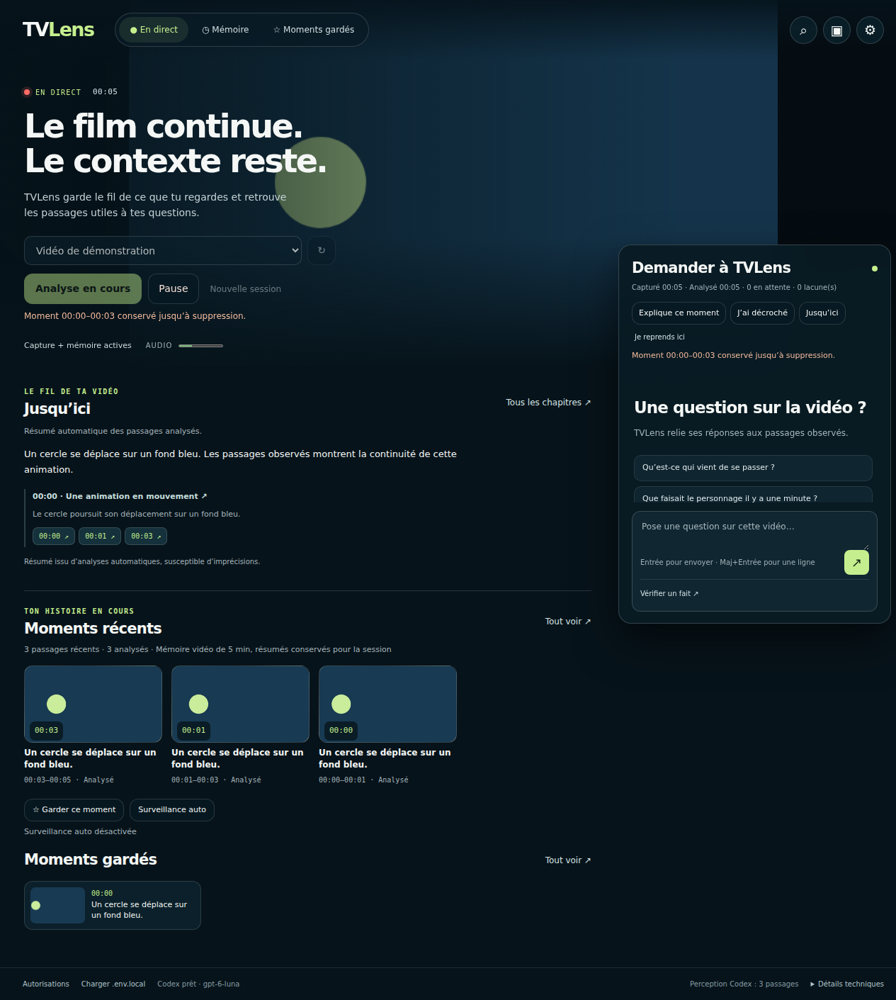

# TVLens

Compagnon de visionnage macOS : capture, mémoire temporelle, chat contextuel et
recherche web. [Architecture hexagonale](docs/architecture.md).

## Démarrer

```sh
npm install
npm run setup:speech
npm run setup:codex
npm start
```

Codex CLI doit être installé et connecté. FFmpeg et Whisper utilisent Homebrew sur
Apple Silicon. La clé `OPENROUTER_API_KEY` dans `.env.local` est facultative pour le
chat et la vision ; elle active les embeddings de recherche. Ne jamais committer
ce fichier. [Installation complète](docs/installation.md).

## Utiliser

1. Choisir une fenêtre/écran et cliquer **Regarder avec TVLens** : capture et
   analyse démarrent ensemble en mode flottant. La dernière source disponible est
   proposée. Premier segment de 2 secondes, puis segments de 8 secondes.
2. **Explique ce moment** (Cmd/Ctrl+Maj+E si disponible) fige l’instant pour le
   résumer, l’expliquer ou poser une question. Le réexamen conserve cet instant.
3. **J’ai décroché** résume depuis le dernier repère ; **Je reprends ici** pose
   un nouveau repère. Le chat montre un aperçu sourcé pendant la réponse.
4. **Jusqu’ici** construit un aperçu global et des chapitres horodatés, accessibles
   aussi en petite fenêtre. Les mises à jour automatiques laissent la priorité
   aux questions. Les textes restent disponibles après expiration des vidéos.
5. **Pause / Reprendre** conserve la mémoire et la discussion. Le temps de capture
   s’arrête pendant la pause. **Nouvelle session** repart de zéro après arrêt.
6. **Réglages IA** choisit les modèles du chat et de la perception. Fermer l’app
   termine le fil Codex en mémoire ; les archives textuelles restent sur disque.

Détails : [actions et latence](docs/friction-latency.md),
[résumé progressif](docs/living-recap.md).

[](screenshots/tvlens-jusqu-ici.png)
[Voir la version compacte](screenshots/tvlens-jusqu-ici-small.png).
La capture illustrée utilise une vidéo et une synthèse de test.

## Exécution actuelle

- Chat : processus Codex App Server maintenu ouvert, un fil par session de visionnage.
- Images/résumés et réexamen : **GPT-6 Luna via Codex** par défaut.
- Paroles : **Whisper base multilingue en local**, puis texte envoyé à Codex.
- Réexamen visuel : planches de six images horodatées avec sélection adaptative.
- OpenRouter : uniquement les embeddings texte, avec cache des descriptions et
  requêtes identiques. Les anciens essais d’inférence restent comptabilisés.
- Capture indépendante, références limitées au préfixe observé, questions en file FIFO et
  annulation ciblée, limite de 60 secondes de traitement hors attente. Cinq minutes de média en temps observé,
  puis résumés conservés pour la session.

Les images et les transcriptions vont à Codex. Ce POC ne fait donc pas encore
l’inférence visuelle localement sur GX10. Les embeddings audio/image restent dans
la roadmap. Les anciennes stratégies OpenRouter restent des adaptateurs historiques,
mais ne sont plus utilisées par l’app.

## Vérification

```sh
npm test
npm run test:electron
npm run test:electron:full-live
npm run test:codex:speed
npm run package:mac
npm run open:mac
```

La dernière validation couvre **96 tests unitaires** et le parcours Electron avec
modèles simulés : [rapport actuel](docs/validation.md). La qualité du récapitulatif
avec le fournisseur réel reste à valider. Sous Linux sans affichage, lancer
`xvfb-run -a npm run test:electron`.

Les essais live consomment le quota Codex et éventuellement les embeddings OpenRouter.
[Mesures et limites actuelles](docs/session-optimization.md).
Les [comparaisons vidéo/planches historiques](docs/strategy-comparison.md) utilisaient
Gemini : leur score ne constitue pas une mesure de qualité de Luna.


Fonctions de visionnage : moments gardés sur disque avec suppression explicite,
recherche de passages avec aperçu, et Auto sur consigne à partir de l’activation.
Le raccourci « Garde ce moment » se configure dans la bibliothèque. Le quota
Codex est affiché à titre informatif, sans seuil de réserve local. OpenRouter
conserve le suivi des dépenses, sans plafond local. Voir
[comportements et validation](docs/viewing-upgrade.md).
